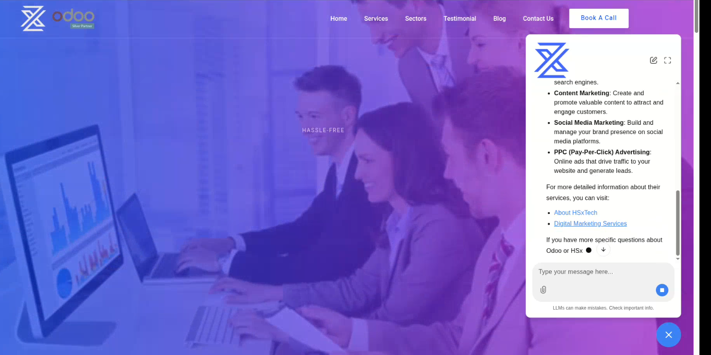

# OdooGenie

**OdooGenie** is an AI-powered web chatbot developed for **HSxTech** to help users interact with Odoo-related information through natural-language conversations.

It provides a conversational interface where users can ask questions and receive AI-generated responses without manually searching through Odoo documentation or business information.

## Demo

[](https://youtu.be/mslVL9Gzc-E)

▶️ **[Watch the demo](https://youtu.be/mslVL9Gzc-E)**

## Key Features

- AI-powered web chatbot
- Natural-language interaction
- Odoo-focused question answering
- Conversational user experience
- Web-based chat interface
- LLM-powered response generation
- Backend API integration
- Docker-based deployment

## Architecture

```text
User
  ↓
Web Chat Interface
  ↓
Backend API
  ↓
AI / LLM
  ↓
Odoo / Knowledge Sources
  ↓
Generated Response
  ↓
User
```

## Tech Stack

| Category | Technologies |
|---|---|
| Language | Python |
| AI / LLM | OpenAI |
| Backend | FastAPI |
| Chat Interface | Web Chatbot |
| AI Framework | LangChain |
| Deployment | Docker |

## Project Structure

```text
1.OdooGenie/
├── assets/
│   └── demo.png
├── ...
└── README.md
```

## Deployment

OdooGenie is containerized and deployed using **Docker**, providing a consistent and portable runtime environment.

## Purpose

OdooGenie was developed as an **AI-powered web chatbot for HSxTech**, enabling users to interact with Odoo-related information through a simple conversational interface.

## Author

**Ali Hamza**  
AI/ML Engineer  
[GitHub](https://github.com/Alihamza-786)
