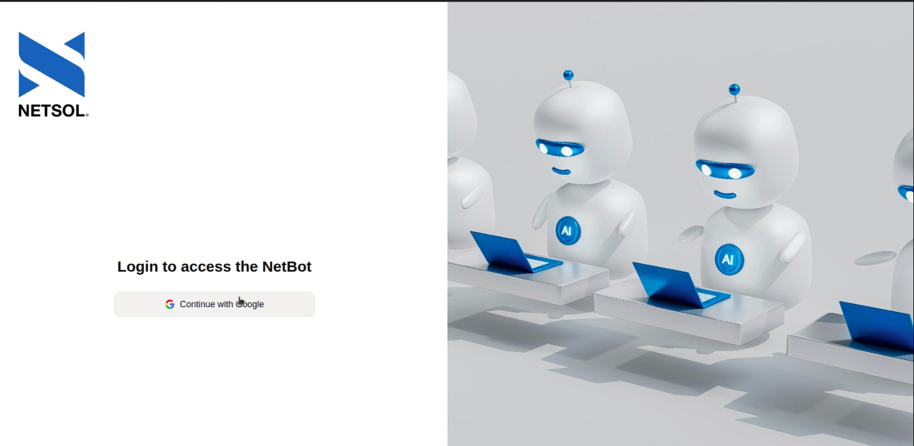

# NETSOL AI Agent

AI-powered conversational agent built for **NETSOL**, combining **LangGraph, RAG, and tool calling** to provide intelligent answers and perform real-world actions.

The agent uses scraped NETSOL website data as its knowledge base and can retrieve information through RAG, search the web, manage Gmail actions, and schedule meetings through a natural-language interface.

## Demo

[](https://youtu.be/cPhgZzj08Jc)

▶️ **[Watch the demo](https://youtu.be/cPhgZzj08Jc)**

## Key Features

* AI agent built with LangGraph and LangChain
* Scraped NETSOL website data for domain-specific knowledge
* RAG-based question answering with FAISS
* Persistent chat history and conversation resume
* PostgreSQL-based persistence
* Gmail tool for sending and drafting emails
* Meeting scheduling through natural language
* WhatsApp meeting scheduling integration
* Google Search tool for real-time web information
* Tool-based agent orchestration
* FastAPI backend
* Chainlit conversational interface
* Google OAuth

## Architecture

```text
User
  ↓
Chainlit
  ↓
FastAPI
  ↓
LangGraph Agent
  │
  ├── RAG Tool → FAISS
  │
  ├── Gmail Tool
  │
  ├── Meeting Scheduler
  │
  ├── WhatsApp Meeting Tool
  │
  └── Google Search
  │
  ↓
PostgreSQL
(Chat Persistence & Resume)
```

## Knowledge & RAG Pipeline

```text
NETSOL Website
      ↓
Web Scraping
      ↓
Document Processing
      ↓
Embeddings
      ↓
FAISS Vector Database
      ↓
RAG Tool
      ↓
LangGraph Agent
      ↓
Context-aware Answer
```

## Tech Stack

| Category        | Technologies                                       |
| --------------- | -------------------------------------------------- |
| Language        | Python                                             |
| AI Framework    | LangChain, LangGraph                               |
| Backend         | FastAPI                                            |
| Chat Interface  | Chainlit                                           |
| Vector Database | FAISS                                              |
| Database        | PostgreSQL                                         |
| RAG             | Retrieval-Augmented Generation                     |
| Tools           | Gmail, Google Search, Meeting Scheduling, WhatsApp |
| Data Source     | NETSOL Website                                     |
| Persistence     | PostgreSQL                                         |
| Deployment      | Docker                                             |

## Agent Capabilities

### Knowledge Retrieval

Answers questions about NETSOL using information scraped from the company's website through a RAG pipeline.

### Gmail

The agent can perform email-related actions through a Gmail tool, including:

* Draft emails
* Send emails
* Manage email workflows

### Meeting Scheduling

Users can interact with the agent using natural language to schedule meetings and coordinate meeting-related actions.

### Web Search

Google Search integration allows the agent to retrieve information beyond its internal knowledge base.

### Persistent Conversations

PostgreSQL stores conversation state, allowing users to resume previous conversations instead of starting from scratch.

## Core Workflow

```text
Natural Language Request
          ↓
     LangGraph Agent
          ↓
   Intent / Tool Selection
          ↓
 ┌────────┼─────────┬──────────┐
 ↓        ↓         ↓          ↓
RAG     Gmail    Scheduler   Search
 ↓        ↓         ↓          ↓
FAISS   Gmail    Meeting      Web
 └────────┴─────────┴──────────┘
          ↓
     Agent Response
          ↓
       Chainlit
```

## Project Highlights

* Multi-tool AI agent architecture
* Graph-based agent orchestration with LangGraph
* Retrieval-Augmented Generation with FAISS
* Real-world action execution through external tools
* Persistent conversational memory using PostgreSQL
* Domain-specific knowledge ingestion through web scraping
* API backend with FastAPI
* Interactive AI interface with Chainlit

## Deployment

The agent was containerized and deployed using **Docker**, providing a consistent environment for the AI agent, API backend, database integrations, and supporting services.

## Author

**Ali Hamza**
AI/ML Engineer
[GitHub](https://github.com/Alihamza-786)

