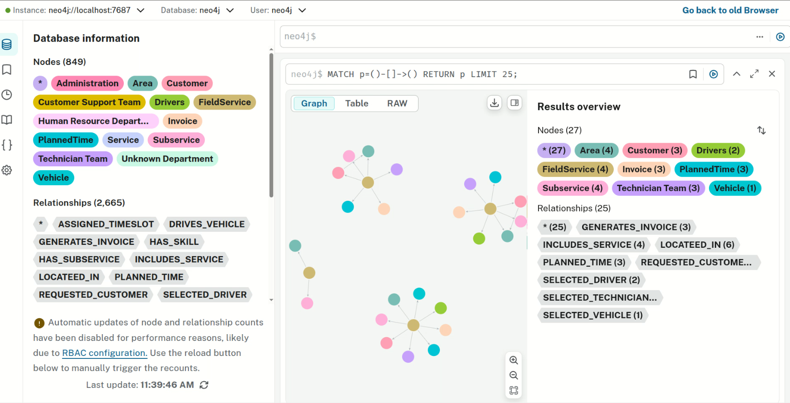

# Noora Chat

AI-powered conversational assistant for **Home Salon by Nooora**, built with **LangGraph, OpenAI, Neo4j, and Chainlit**.

The system converts natural-language questions into **schema-aware Cypher queries**, retrieves information from a Neo4j graph database, and generates human-friendly answers.

## Demo

[](https://youtu.be/Ho1huKQXmeU)

▶️ **[Watch the demo](https://youtu.be/Ho1huKQXmeU)**

## Architecture

```text
User
  ↓
Chainlit
  ↓
LangGraph
  ↓
Question Rewriting
  ↓
Text-to-Cypher
  ↓
Neo4j
  ↓
Query Results
  ↓
LLM
  ↓
Final Answer
```

## Key Features

- Natural-language querying of Neo4j data
- LLM-powered Text-to-Cypher generation
- Schema-aware graph querying
- LangGraph agent workflow with retry handling
- Tavily web search integration
- Excel and CSV export
- Streaming chatbot responses
- FastAPI backend
- Docker-based deployment

## Tech Stack

| Category | Technologies |
|---|---|
| Language | Python |
| LLM | OpenAI GPT-4.1-mini |
| AI Framework | LangChain, LangGraph |
| Database | Neo4j, Cypher |
| UI | Chainlit |
| Backend | FastAPI |
| Web Search | Tavily |
| Data Processing | Pandas |
| Deployment | Docker |
| Local LLM | Ollama / Qwen |

## Project Structure

```text
Noora-chat/
├── assets/
│   └── demo.png
├── chainlit_app.py
├── langgraph_chatbot.py
├── main.py
├── jupyter.ipynb
└── README.md
```

## Core Workflow

**Natural Language → Question Rewriting → Cypher Generation → Neo4j Retrieval → LLM Response**

The application uses LangGraph to orchestrate the workflow and Neo4j to retrieve structured business information through generated Cypher queries.

## Deployment

The application is containerized and deployed using **Docker**, with configuration and API credentials managed through environment variables.

## Author

**Ali Hamza**  
AI/ML Engineer  
[GitHub](https://github.com/Alihamza-786)
